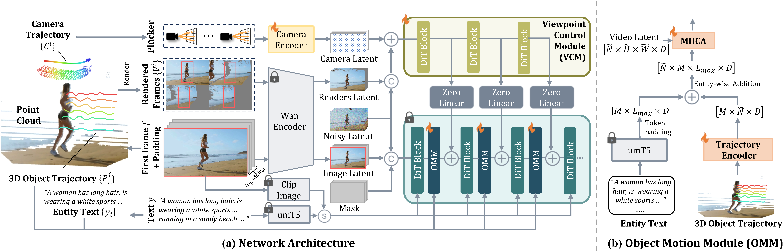

<div align="center">
<h1> SymphoMotion </h1>
<h3> Joint Control of Camera Motion and Object Dynamics for Coherent Video Generation </h3>
<div align="center">
</div>

[](https://grenoble-zhang.github.io/SymphoMotion/)&nbsp;
[](http://arxiv.org/abs/2604.03723)&nbsp;
</div>

Authors: [Guiyu Zhang](https://grenoble-zhang.github.io/)<sup>*1</sup>, [Yabo Chen](https://scholar.google.com/citations?user=6aHx1rgAAAAJ&hl=zh-TW)<sup>*2</sup>, [Xunzhi Xiang](https://xbxsxp9.github.io/)<sup>3</sup>, [Junchao Huang](https://junchao-cs.github.io/)<sup>1</sup>, [Zhongyu Wang](https://scholar.google.com.hk/citations?user=BYTfdcUAAAAJ&hl=zh-CN&oi=sra)<sup>4</sup>, [Li Jiang†](https://llijiang.github.io/)<sup>1</sup>

<sup>1</sup> The Chinese University of Hong Kong, Shenzhen&emsp;<sup>2</sup> Shanghai Jiao Tong University&emsp;<sup>3</sup> Nanjing University&emsp;<sup>4</sup> Beihang University


## BibTeX

If you find our work useful in your research, please consider citing our paper:
```bibtex
@article{zhang2026symphomotion,
  title={SymphoMotion: Joint Control of Camera Motion and Object Dynamics for Coherent Video Generation},
  author={Zhang, Guiyu and Chen, Yabo and Xiang, Xunzhi and Huang, Junchao and Wang, Zhongyu and Jiang, Li},
  journal={arXiv preprint arXiv:2604.03723},
  year={2026}
}
```

## Acknowledgement

Thansk for these excellent opensource works and models: [ViewCrafter](https://github.com/Drexubery/ViewCrafter) and [Uni3C](https://github.com/alibaba-damo-academy/Uni3C).
