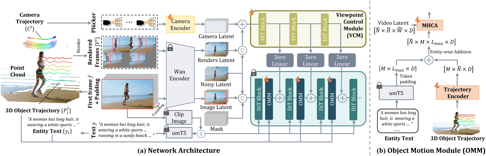

<div align="center">
<h1> SymphoMotion </h1>
<h3> Joint Control of Camera Motion and Object Dynamics for Coherent Video Generation </h3>

[](https://grenoble-zhang.github.io/SymphoMotion/)&nbsp;
[](http://arxiv.org/abs/2604.03723)&nbsp;
[](https://huggingface.co/fateforward/Symphomotion)&nbsp;
[](https://modelscope.cn/datasets/Grenoble/symphomotion-dataset)
</div>

Authors: [Guiyu Zhang](https://grenoble-zhang.github.io/)<sup>1</sup>, [Yabo Chen](https://scholar.google.com/citations?user=6aHx1rgAAAAJ&hl=zh-TW)<sup>2</sup>, [Xunzhi Xiang](https://xbxsxp9.github.io/)<sup>3</sup>, [Junchao Huang](https://junchao-cs.github.io/)<sup>1</sup>, [Zhongyu Wang](https://scholar.google.com.hk/citations?user=BYTfdcUAAAAJ&hl=zh-CN&oi=sra)<sup>4</sup>, [Li Jiang†](https://llijiang.github.io/)<sup>1</sup>

<small><small><sup>1</sup> The Chinese University of Hong Kong, Shenzhen&emsp;<sup>2</sup> Shanghai Jiao Tong University&emsp;<sup>3</sup> Nanjing University&emsp;<sup>4</sup> Beihang University</small></small>



## Installation

The code is tested with Python 3.10, PyTorch 2.x, CUDA 12.6, bf16 mixed precision, and `accelerate`.

```bash
git clone https://github.com/Grenoble-Zhang/SymphoMotion.git
cd SymphoMotion

# Create conda environment
apt-get update && apt-get install tmux ffmpeg libsm6 libxext6 libglm-dev -y
conda create -n symphomotion python=3.10
conda activate symphomotion

# Install PyTorch with CUDA 12.6 support
pip install torch==2.6.0 --index-url https://download.pytorch.org/whl/cu126
pip install torchvision==0.21.0 --index-url https://download.pytorch.org/whl/cu126
pip install torchaudio==2.6.0 --index-url https://download.pytorch.org/whl/cu126

# Install dependencies
pip install -r requirements.txt
pip install carvekit --no-deps

# Install PyTorch3D
git clone https://github.com/facebookresearch/pytorch3d.git
cd pytorch3d && pip install -e .
cd ..
```

## Download Models

```bash
# Base model
huggingface-cli download Wan-AI/Wan2.1-I2V-14B-720P-Diffusers \
  --local-dir pretrained_models/Wan2.1-I2V-14B-720P-Diffusers

# SymphoMotion checkpoints
huggingface-cli download fateforward/Symphomotion \
  --include "pretrained_checkpoints/*" \
  --local-dir .
```

## Quick Start

We provide 8 demo samples in `assets/demo_samples/` with camera trajectories and object annotations.

### Run Demo

```bash
bash scripts/infer_joint.sh
```

Results are saved to `outputs/inference/generated_videos/`.

## Training

### Stage 1: Camera Control

```bash
# Prepare your training data CSV
export CSV_PATH=data/train.csv
export PRETRAINED_MODEL_PATH=pretrained_models/Wan2.1-I2V-14B-720P-Diffusers
export OUTPUT_DIR=outputs/camera_control

# Optional: Load pretrained ControlNet (omit to train from scratch)
# export CONTROLNET_PATH=path/to/pretrained/controlnet.pth

bash scripts/train_camera_control.sh
```

### Stage 2: Object Control

```bash
export CSV_PATH=data/train.csv
export PRETRAINED_MODEL_PATH=pretrained_models/Wan2.1-I2V-14B-720P-Diffusers
export CONTROLNET_PATH=pretrained_checkpoints/camera_control/controlnet.pth
export OUTPUT_DIR=outputs/object_control

bash scripts/train_object_control.sh
```

## Data Format

Each sample in `assets/demo_samples/` contains:

```
sample_name/
├── first_image.png              # Input image
├── full_prompt.json             # Text prompt
├── spatialtracker2.npz          # Camera trajectory + object tracks
└── render_output/
    ├── render_with_2d_bbox.mp4  # Visualization
    └── render_mask.mp4          # Object mask
```

The CSV manifest (`assets/demo.csv`) lists sample paths for batch inference.

## Citation

```bibtex
@article{zhang2026symphomotion,
  title={SymphoMotion: Joint Control of Camera Motion and Object Dynamics for Coherent Video Generation},
  author={Zhang, Guiyu and Chen, Yabo and Xiang, Xunzhi and Huang, Junchao and Wang, Zhongyu and Jiang, Li},
  journal={arXiv preprint arXiv:2604.03723},
  year={2026}
}
```

## Acknowledgement

Thanks to [ViewCrafter](https://github.com/Drexubery/ViewCrafter), [Uni3C](https://github.com/alibaba-damo-academy/Uni3C), and Wan2.1.
